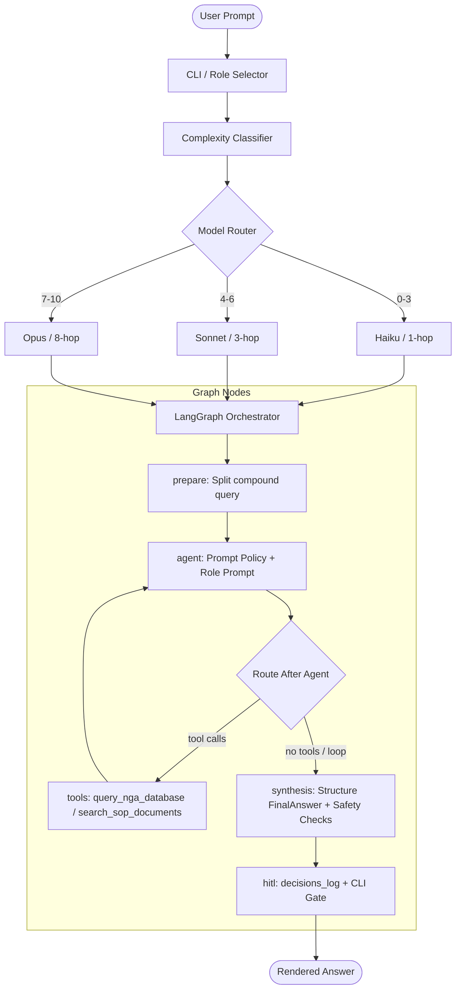

# NGA Manufacturing Assistant — Agentic Decision Support

The NGA Manufacturing Assistant is a production-grade, role-aware agentic framework designed for **Apex Automotive — Northgate Assembly Plant (NGA)**. It acts as an intelligent manufacturing assistant that helps operators, technicians, engineers, and plant managers make fast, compliant operational decisions while strictly adhering to Standard Operating Procedures (SOPs).

The architecture is adapted from the `DSS_Prototype` reference workflow and extended to handle 4-tier role-based access control, safety-critical Class A defects, recall evaluation criteria (QCR-501), and multi-document inconsistencies.

---

## 🛠️ Technology Stack & Rationale

| Technology | Selected Component | Why This Stack Was Chosen |
|---|---|---|
| **Orchestration** | **LangGraph** | Provides a state-machine framework to define deterministic, predictable paths (`prepare` → `agent` ⇆ `tools` → `synthesis` → `hitl`). This prevents unstructured agent wandering and guarantees that safety verification nodes are always hit before outputting answers. |
| **Vector DB** | **ChromaDB** | Lightweight, file-system persistent database that supports standard metadata filtering. Crucial for enforcing path-derived RBAC constraints during retrieval (`level_rank <= user_level`) directly inside the similarity search. |
| **Knowledge Graph** | **NetworkX** | Python-native graph library. Used to persist extracted entities and relationships (e.g. `Machine`, `FaultCode`, `RecallCriteria`) for GraphRAG BFS expansion and multi-hop reasoning. |
| **Security (SQL)** | **SQLGlot** | Strict SQL AST parser. Validates generated text-to-SQL commands prior to execution. Restricts execution strictly to single, read-only `SELECT` queries, matching the live database schema (via `PRAGMA table_info`) to block SQL injection completely. |
| **Package Manager** | **uv / hatchling** | Modern, extremely fast Python package installer and workspace sync tool. Guarantees reproducible builds via locked dependencies. |
| **Testing** | **pytest** | Standard framework used to run the 75-question QA evaluation suite and the conflict detection scenarios as parameterized integration tests. |

---

## 📐 System Design & Architecture



### 1. 4-Tier Role-Based Access Control (RBAC)
To protect sensitive quality records and plant metrics, access is strictly partitioned:
* **operator (rank 1)**: Access restricted to `operator-sops/` (assembly procedures, wheel torque).
* **technician (rank 2)**: Adds access to `technician-sops/`, `machine-details/`, and `maintenance-work-orders/`.
* **engineer (rank 3)**: Adds access to `failure-analysis/`, `supplier-quality/`, and `training/`.
* **manager (rank 4)**: Adds full access to safety recalls (`recall-quality/`) and regulatory stop-ship logs.

*Security Note: Access levels are derived server-side from document folder paths, preventing metadata poisoning from caller input.*

### 2. Multi-Hop Hybrid Retrieval (Vector + GraphRAG)
* **Vector Store**: Semantic similarity search in ChromaDB, filtered by category and access level rank: `{"level_rank": {"$lte": user_level}}`.
* **GraphRAG**: Builds an entity-relationship graph (e.g. `SOP-OPR-101 -- requires --> TQ-6012`). Seeds are identified using cosine similarity of query embeddings, and a BFS expansion retrieves adjacent nodes while pruning any node with `level_rank > user_level`.

### 3. Human-in-the-Loop (HITL) Safety Gate
All high-consequence recommendation verbs (e.g., `stop-ship`, `quarantine`, `recall`, `halt line`) are intercepted. 
* Recommendations are persisted to `app_state.db` under the `decisions_log` audit trail.
* If a Class A (safety-critical) action is detected, the CLI prompts for a **mandatory approver ID** and requires justification on rejection.

---

## 🚀 Getting Started & Setup

### 1. Prerequisites
Ensure you have `uv` installed. If not, install it via:
```bash
curl -LsSf https://astral.sh/uv/install.sh | sh
```

### 2. Clone and Setup Environment
Copy the env template and set your valid **OpenRouter API Key** (or use local Ollama config if switching to `Local` execution environment):
```bash
cp .env.example .env
# Edit .env and fill in:
# OPENROUTER_API_KEY=your-real-openrouter-key
```

### 3. Install Dependencies
Sync project dependencies:
```bash
uv sync
```

### 4. Build the Retrieval Bases
Build the Chroma vector store and the GraphRAG knowledge graph:
```bash
# Ingests all 48 SOPs/specs with RBAC metadata
uv run python -m nga.ingestion.build_vector_store

# Extracts entity-relation links and saves the graph
uv run python -m nga.ingestion.build_graph
```

### 5. Start the Interactive CLI
Launch the assistant. You can specify a starting role (`operator`, `technician`, `engineer`, `manager`). 
```bash
uv run python -m nga.cli --role operator
```
*Tip: You can switch roles mid-session in the prompt by typing `role manager` or `role technician`.*

---

## 📊 Running Evaluations & Benchmarks

### 1. 75-Question Integration Benchmark
Runs the complete test suite against `eval-questions/questions.json` spanning fact retrieval, multi-hop reasoning, scenarios, escalations, and live SQL generation:
```bash
# Run with deterministic scoring checks
uv run pytest tests/integration/test_benchmark.py -v -s

# Run with LLM-as-judge scoring enabled (uses API)
uv run pytest tests/integration/test_benchmark.py -v -s --judge
```
*Evaluation results, latency logs, and details of failed cases are saved automatically to `reports/eval/` in Markdown and JSON.*

### 2. Planted Conflict Detection Evals
Tests the agent's ability to identify and flag the 8 planted contradictions (e.g. wheel torque 108 vs 105 Nm, calibration cycles, windshield cure times) when the `variant-corpus/` is ingested:
```bash
uv run pytest tests/integration/test_conflict_detection.py -v -s
```

---

## 📂 Corpus Universe & Document Index

The synthetic NGA corpus maps the operations of the fictional **Apex Automotive — Northgate Assembly Plant (NGA)** manufacturing compact SUVs (Aurora AU-2025) and sedans (Solstice SO-2025) at a rate of 42 vehicles/hour across three shifts (A, B, C).

### Document Directory Structure:
* [`operator-sops/`](file:///Users/ruiping/projects/manufacturing_agent/operator-sops/): Wheel torques (105 Nm ±5%), adhesive open times, and standard final audits.
* [`technician-sops/`](file:///Users/ruiping/projects/manufacturing_agent/technician-sops/): Weld fault diagnosis, conveyor jam recovery, and paint robot P-codes.
* [`machine-details/`](file:///Users/ruiping/projects/manufacturing_agent/machine-details/): Robot reach specifications and calibration intervals (3 months / 100k cycles).
* [`failure-analysis/`](file:///Users/ruiping/projects/manufacturing_agent/failure-analysis/): 8D problem-solving (FAP-401) and escalation timelines (ESC-402).
* [`recall-quality/`](file:///Users/ruiping/projects/manufacturing_agent/recall-quality/): Recall criteria (QCR-501) for safety, defect rates, and regulatory reporting.
* [`additional-docs/`](file:///Users/ruiping/projects/manufacturing_agent/additional-docs/): Maintenance work orders, supplier quality audits, and personnel certifications.
* [`database/`](file:///Users/ruiping/projects/manufacturing_agent/database/): Seeded SQLite database (`nga.db`) containing production, quality checks, work orders, and training histories.
