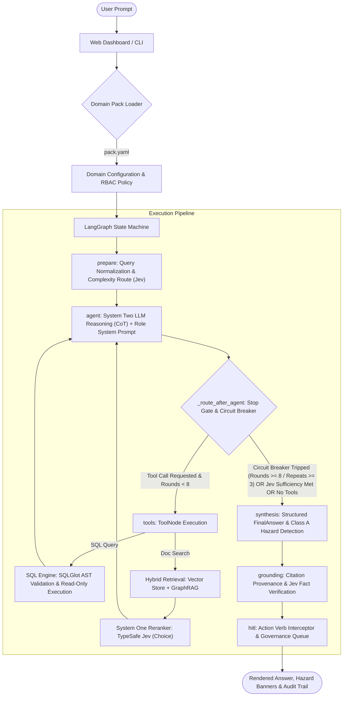

# Enterprise Agentic Decision Support Framework
### Flagship Benchmark: Apex Automotive — Northgate Assembly Plant (NGA)

> **⚠️ Disclaimer — Synthetic Evaluation Corpus**:  
> All data in this repository — including **Apex Automotive**, the **Northgate Assembly Plant (NGA)**, vehicle models (*Aurora AU-2025*, *Solstice SO-2025*), Standard Operating Procedures (SOPs), machine specifications, fault codes, non-conformance records, torque logs, SQLite database tables (`nga.db`), and the banking demonstration data (`banking.db`) — is **entirely synthetic and fictional**. It has been generated strictly for research, testing, and AI decision-support benchmark evaluation purposes.

---

The **Enterprise Agentic Decision Support Framework** is an extensible, production-grade, role-aware agentic platform engineered for mission-critical industrial decision support. It decouples high-assurance AI governance, deterministic retrieval-grounding, and state-machine orchestration from any single business vertical via **Declarative Domain Packs**.

The repository contains:
1. **Generic Enterprise Agent Engine (`src/enterprise_agent/`)**: Domain-agnostic orchestration, multi-format document ingestion (Markdown, JSON, CSV, TXT), AST-validated read-only text-to-SQL execution via SQLGlot, System One semantic reranking via TypeSafe AI Jev (`Choice` primitive), and policy-driven Human-in-the-Loop (HITL) gates.
2. **Flagship Domain: NGA Manufacturing Assistant (`src/nga/`)**: A specialized automotive manufacturing assistant tailored for the synthetic **Apex Automotive — Northgate Assembly Plant (NGA)**, enforcing 4-tier Role-Based Access Control (RBAC), safety-critical Class A defect containment, recall triggers (QCR-501), and dual-path hybrid retrieval (ChromaDB vector search + NetworkX GraphRAG).
3. **Banking Domain Pack (`domains/banking/`)**: A financial crime and AML/sanctions compliance decision support pack demonstrating domain portability across banking policies, SAR filings, and OFAC watchlists.
4. **Deterministic Evaluation & Grounding Suite**: 4-tier stepped benchmark suites (85 questions), quantitative Graph Quality metrics, A/B release gates, multi-model Pareto arena, citation existence & retrieval provenance verification, and **TypeSafe AI Jev** calibrated System One scoring.

---

## 🛠️ Technology Stack & Rationale

| Technology | Selected Component | Why This Stack Was Chosen |
|---|---|---|
| **Orchestration** | **LangGraph** | Provides a state-machine framework defining deterministic, predictable paths (`prepare` → `agent` ⇆ `tools` → `synthesis` → `hitl`). Guarantees that governance, circuit breakers, and safety verification execute in order. |
| **Vector DB** | **ChromaDB** | Lightweight, persistent vector store supporting exact metadata filtering. Enforces path-derived RBAC constraints (`level_rank <= user_level`) directly during similarity search. |
| **Knowledge Graph** | **NetworkX** | Python-native graph library persisting extracted manufacturing entities and relations (e.g., `Machine`, `FaultCode`, `RecallCriteria`) for GraphRAG multi-hop BFS reasoning. |
| **System One Reranker** | **TypeSafe AI Jev** (`typesafe-ai/jev`) | Sub-30ms System One `Choice` reranker evaluating candidate passage relevance against query context in a single forward pass, replacing heavy GPU cross-encoders with zero GPU infrastructure. |
| **Security & SQL Engine** | **SQLGlot** | Strict SQL AST parser and validator. Validates generated text-to-SQL commands prior to execution, restricting queries strictly to single, read-only `SELECT` statements matching the live database schema. |
| **Fast Evaluation Judge** | **TypeSafe AI Jev** | System One non-generative decision model using Reinforcement Learning for Calibrated Decisions (RLCD). Evaluates groundedness and correctness in sub-50ms with zero token generation cost. |
| **Package Manager** | **uv / hatchling** | Modern, reproducible Python package installer and workspace manager with locked dependencies. |
| **Testing** | **pytest** | Full automated test suite covering unit APIs, integration benchmarks, stress tests, and deterministic grounding checks. |

---

## 📐 System Architecture



---

## 🏢 Generic Enterprise Agentic Framework (`src/enterprise_agent/`)

The framework is decoupled into domain-agnostic components configured declaratively via YAML domain packs:

```
domains/
├── manufacturing/
│   └── pack.yaml             # Apex Automotive NGA configuration
└── banking/
    ├── pack.yaml             # Global Horizon Bank AML configuration
    └── init_db.py            # SQLite seed script for banking transactions
```

### Domain Pack Architecture (`pack.yaml`)
Each domain pack defines:
- **`domain`**: Unique identifier, title, description, and version.
- **`rbac`**: Hierarchy of roles (e.g. `operator: 1` to `manager: 4`), tailored role system prompts, and folder-path security classification rules.
- **`database`**: SQLite connection URI, tool registration name/description, and an explicit whitelist of `allowed_tables`.
- **`documents`**: Document search tool configuration, supported file extensions (`.md`, `.json`, `.csv`, `.txt`), category definitions, document ID regex patterns, and excluded files.
- **`governance`**: High-consequence action verbs triggering Human-in-the-Loop review (e.g. `stop-ship`, `quarantine`, `freeze account`, `file sar`), critical safety/compliance terms, and escalation levels.

### Multi-Format Document Ingestion
The generic document loader (`src/enterprise_agent/documents/loader.py`) parses and ingests:
- **Markdown (`.md`)**: Extracts YAML frontmatter, headings, sections, and embedded document IDs.
- **JSON (`.json`)**: Recursively flattens structured records into searchable textual chunks.
- **CSV (`.csv`)**: Formats tabular data with header-aware row annotations.
- **Plain Text (`.txt`)**: Paragraph and sliding-window chunking.

---

## 🎯 System One Document Reranking (TypeSafe Jev)

To enhance retrieval precision beyond pure dense vector embeddings, the framework integrates a **System One Jev Reranker** (`src/enterprise_agent/retrieval/reranker.py`):
1. **Initial Retrieval**: Retrieves candidate chunks from ChromaDB and the GraphRAG knowledge graph across document categories.
2. **Jev Choice Evaluation**: Submits all candidate chunks as options in a single TypeSafe `Choice` call (`typesafe-ai/jev`), evaluating semantic relevance in sub-30ms with zero token generation cost.
3. **Calibrated Probability Ranking**: Sorts documents by the model's calibrated probability distribution and selects the top $N$ (default: 5) most authoritative passages for downstream synthesis.

---

## 🛡️ Human-in-the-Loop (HITL) Safety & Governance

High-consequence operational decisions cannot be executed autonomously. The governance policy gate (`src/enterprise_agent/hitl/policy_gate.py` and `src/nga/hitl/`):
- **Action Verb Interception**: Detects mandatory approval verbs (e.g., `stop-ship`, `quarantine`, `recall`, `freeze account`, `file sar`).
- **Audit Logging**: Logs pending actions to `app_state.db` under `decisions_log`.
- **Mandatory Approver Identification**: Enforces approver credentials and engineering/compliance justification for critical actions before authorization.

---

## 🚀 Getting Started & Setup

### 1. Prerequisites
Ensure you have `uv` installed:
```bash
curl -LsSf https://astral.sh/uv/install.sh | sh
```

### 2. Environment Configuration
Copy the `.env.example` template to `.env`:
```bash
cp .env.example .env
```

Configure your credentials in `.env`:
```ini
# OpenRouter API Key for Cloud execution
OPENROUTER_API_KEY=your-openrouter-api-key
OPENROUTER_MODEL=anthropic/claude-sonnet-4-5

# TypeSafe AI API Key (for System One Jev Reranking & Judge)
TYPESAFE_API_KEY=your-typesafe-api-key
RERANK_ENABLED=true
RERANK_MODEL=jev-1.12
RERANK_TOP_N=5

# Active Domain Pack
DOMAIN_PACK=domains/manufacturing/pack.yaml
```

### 3. Install Dependencies
```bash
uv sync
```

### 4. Ingest Corpus & Build Knowledge Graph
Build the Chroma vector store and the GraphRAG knowledge graph for the manufacturing domain:
```bash
# Ingest all SOPs and specs with RBAC metadata
uv run python -m nga.ingestion.build_vector_store

# Extract entity-relation graph for GraphRAG
uv run python -m nga.ingestion.build_graph
```

*(Optional) Seed the banking demonstration database:*
```bash
uv run python domains/banking/init_db.py
```

### 5. Launch the Web User Interface (Recommended)
Launch the manufacturing operations dashboard:
```bash
uv run python -m nga.ui.runner --port 8000 --host 127.0.0.1 --open-browser
```
Access `http://127.0.0.1:8000` to interact with:
- **Role Switching**: Toggle between Operator (L1), Technician (L2), Engineer (L3), and Plant Manager (L4).
- **Structured Answers**: Class A hazard banners, ESC-402 escalation levels, QCR-501 recall triggers, and verified citations.
- **HIL Approval Queue**: Review, authorize, or reject safety-critical actions.
- **Real-Time Execution Logs**: Inspect the LangGraph state trace and SQL queries.
- **Evaluation Dashboards**: Run and compare benchmark suites live.

### 6. Interactive CLI
Run the NGA manufacturing CLI:
```bash
uv run python -m nga.cli --role operator
```

Run the Generic Enterprise CLI with any domain pack:
```bash
# Automotive manufacturing domain
uv run python -m enterprise_agent.cli --domain domains/manufacturing/pack.yaml --role operator

# Banking AML domain
uv run python -m enterprise_agent.cli --domain domains/banking/pack.yaml --role compliance_analyst
```

---

## 📊 Evaluation & Verification Architecture

The platform features an evaluation architecture combining automated regression tests, multi-dashboard analytics, deterministic grounding auditing, and fast non-generative judges.

```
                               ┌──────────────────────────────────────────────┐
                               │       Evaluation Runner (85 Questions)       │
                               └──────────────────────┬───────────────────────┘
                                                      │
                       ┌──────────────────────────────┴──────────────────────────────┐
                       ▼                                                             ▼
        ┌─────────────────────────────┐                               ┌─────────────────────────────┐
        │   Deterministic Grounding   │                               │     LLM / Jev as Judge      │
        │      Auditor (Tier 1 & 2)   │                               │   (Correctness & Quality)   │
        └──────────────┬──────────────┘                               └──────────────┬──────────────┘
                       │                                                             │
         [Citation Existence & Provenance]                             [System One Calibrated Scoring]
                       │                                                             │
                       └──────────────────────────────┬──────────────────────────────┘
                                                      ▼
                                       ┌──────────────────────────────┐
                                       │   Summary Report & History   │
                                       │ (4 Dashboards & SVG Trends)  │
                                       └──────────────────────────────┘
```

### 1. Deterministic Retrieval-Grounding Auditing (`src/nga/evaluation/grounding.py`)
Validates that every citation produced in an agent's answer is grounded in real documents and actual retrieval tool results:
- **Tier 1 — Citation Existence**: Audits cited document IDs and chunk IDs against the corpus manifest (`build_corpus_manifest`). Detects and flags any fabricated or hallucinated document IDs.
- **Tier 2 — Retrieval Provenance**: Verifies that cited documents were genuinely retrieved by tool calls during the execution trajectory, eliminating orphan citations.
- **Grounding Score**: Produces composite grounding scores and integrates them into CI evaluation reports.

### 2. TypeSafe AI Jev Judge vs. Classical LLM Judge (`src/nga/evaluation/judge.py`)
- **TypeSafe AI Jev Judge**: Powered by `typesafe-ai/jev`, evaluating responses using non-generative System One calibrated scoring. Delivers sub-50ms evaluation latency with deterministic, reproducible scores and zero token generation cost.
- **Classical LLM Judge**: Evaluates answer accuracy and completeness via generative text prompting.
- **Full-Suite Comparison**: Run the 85-question benchmark comparison script:
  ```bash
  uv run python scripts/full_suite_judge_comparison.py
  ```

### 3. The Four Enterprise Evaluation Dashboards
- **Dashboard 1: Graph Quality Metrics**: Quantitative ingestion-time monitoring for Knowledge Graphs: Entity Extraction F1, Relation Accuracy, Entity Alignment Success Rate, and Knowledge Coverage Rate against gold ground-truth facts.
- **Dashboard 2: Stepped Evaluation Suite**: Stratifies benchmark questions across 4 difficulty tiers: L1 (Single-Hop Fact) → L2 (Two-Hop Relation) → L3 (Three-Hop Cross-Doc) → L4 (Multi-Domain Challenge) with reasoning degradation slope analysis.
- **Dashboard 3: A/B Testing & Release Gates**: Validates candidate runs against pure vector baselines with **6 Hard Release Criteria** (Pass Rate $\ge 85\%$, L3/L4 Uplift $\ge +10\%$, zero regressions, 100% Class A recall, $\le 12\text{s}$ latency ceiling, SQL injection safe).
- **Dashboard 4: Multi-Model Arena**: Side-by-side benchmark comparing Claude 3.5 Sonnet, GPT-4o, Gemini 1.5 Pro/Flash, DeepSeek V3/R1, and Grok-2 on accuracy, latency, token costs, and Pareto efficiency.

### 4. Multi-Tier Caching System (`src/nga/cache/`)
SQLite-backed multi-tier cache to accelerate iterative development and evaluation:
- **L0 (Embedding)**: Caches text-to-embedding vector mappings.
- **L1 (Retrieval)**: Caches query results scoped by categories, $k$, corpus version, and **user RBAC level**.
- **L2 (SQL)**: Caches validated `SELECT` queries, automatically invalidated by database `data_version` etags.
- **Cold vs. Hot Evaluation Modes**: Benchmark against an empty cache (`--cache-mode cold`) or evaluate warm repeated-query throughput (`--cache-mode hot`).

### 5. Token Consumption & Cost Efficiency KPIs (Jev vs. Fallback)
Quantifies operational token economics and ROI between **System One Jev acceleration** and **fallback/baseline configurations**:
- **Token Consumption Efficiency Ratio (TCER)**: $\frac{T_{\text{in}}^{\text{Jev}} + T_{\text{out}}^{\text{Jev}}}{T_{\text{in}}^{\text{Fallback}} + T_{\text{out}}^{\text{Fallback}}}$ ($\le 0.45$ target across multi-hop queries).
- **Zero Auxiliary Output Tokens**: Jev decisions produce zero output tokens ($T_{\text{out}} = 0$, $100\%$ elimination of decision completion tokens).
- **Tool-Loop Truncation Savings**: Semantic early exit eliminates 2–6 redundant LLM agent turns, yielding up to **70% net cost savings** per 1k complex queries compared to mechanical circuit breaker fallbacks.

---

## 🧪 Automated Test Suites

The repository contains an automated test suite across unit, integration, and security layers:

```bash
# Run all unit and integration tests
uv run pytest tests/test_*.py -v

# Run Generic Enterprise Framework tests
uv run pytest tests/test_generic_framework.py -v

# Run TypeSafe Jev Reranker tests
uv run pytest tests/test_rerank.py -v

# Run Deterministic Grounding tests
uv run pytest tests/test_grounding.py -v

# Run Judge Comparison tests (TypeSafe Jev vs LLM Judge)
uv run pytest tests/test_judge_comparison.py -v

# Run Multi-Tier Cache tests
uv run pytest tests/test_cache.py -v

# Run Web UI API integration tests
uv run pytest tests/test_ui_api.py -v

# Run Adversarial & Concurrency Stress tests
uv run pytest tests/integration/test_stress.py -v
```

---

## 📂 Repository Directory Structure

```
.
├── domains/                          # Declarative Domain Packs
│   ├── manufacturing/                # Automotive NGA domain pack (pack.yaml)
│   └── banking/                      # Banking AML & sanctions domain pack (pack.yaml, init_db.py)
├── src/
│   ├── enterprise_agent/             # Generic Enterprise Agent Framework
│   │   ├── cli.py                    # Multi-domain interactive CLI
│   │   ├── config/                   # Domain pack YAML loader and validation
│   │   ├── database/                 # SQLite engine, SQLGlot AST validation
│   │   ├── documents/                # Multi-format document loader (MD, JSON, CSV, TXT)
│   │   ├── graph/                    # Domain-agnostic LangGraph state machine & nodes
│   │   ├── hitl/                     # Policy gate & action verb interceptor
│   │   ├── models/                   # Structured answer schemas & renderer
│   │   ├── retrieval/                # System One reranker (TypeSafe Jev Choice)
│   │   └── tools/                    # Dynamic tool factory (SQL & Document tools)
│   └── nga/                          # NGA Manufacturing Flagship Implementation
│       ├── cache/                    # L0/L1/L2 multi-tier SQLite caching
│       ├── cli.py                    # Manufacturing terminal chat loop
│       ├── config.py                 # NGA configuration & environment bindings
│       ├── evaluation/               # Grounding auditor, Jev judge, stepped suite, CI tracker
│       ├── graph/                    # NGA LangGraph nodes & workflow definitions
│       ├── graphrag/                 # NetworkX knowledge graph & BFS hybrid retrieval
│       ├── hitl/                     # NGA Human-in-the-Loop decision gate
│       ├── ingestion/                # Vector store & graph builder pipelines
│       ├── tools/                    # NGA SQL & document retrieval tools
│       └── ui/                       # Modern web dashboard (FastAPI backend + web assets)
├── scripts/                          # Utility & benchmark comparison scripts
│   └── full_suite_judge_comparison.py# Jev Judge vs Classical LLM Judge full-suite runner
├── tests/                            # Comprehensive unit, integration, and stress tests
├── eval-questions/                   # 85 synthetic benchmark evaluation questions
├── eval-graph/                       # Gold standard manufacturing knowledge graph
├── database/                         # Seeded NGA SQLite production database (nga.db)
├── operator-sops/                    # Operator SOPs (Torque, adhesive, windshield)
├── technician-sops/                  # Technician SOPs (Weld faults, robot P-codes)
├── machine-details/                  # Machine reach, calibration, and maintenance specs
├── failure-analysis/                 # 8D problem-solving (FAP-401) & escalation (ESC-402)
├── recall-quality/                   # Recall evaluation criteria (QCR-501)
├── additional-docs/                  # Maintenance work orders, supplier quality, training
└── pyproject.toml                    # Package definition and workspace dependencies
```

---

## 📄 License & Synthetic Universe Citation

This project is created for research and evaluation purposes. All data, standard operating procedures, vehicle models, assembly lines, and organizational structures are entirely fictional.
